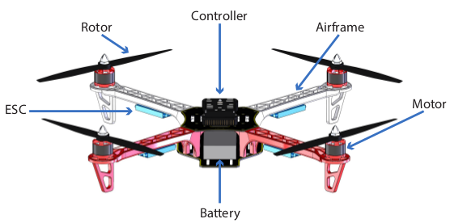

# Unmanned Aerial Vehicle
**THIS EXAMPLE IS NO LONGER MAINTAINED. IF YOU ARE INTERESTING IN THE EXAMPLE, SEE THE CONTACT DETAILS AT THE BOTTOM**
## Overview
The study models the physical dynamics as well as the discrete controller of an Unmanned Aerial Vehicle (UAV). Focus on the details of the model contribute to a high model fidelity, enabling the multi-model to be used to compare alternative control algorithms.

The main components of the UAV include the airframe, which is the main body the UAV, the propulsion system consisting of rotors, motors, and electronic speed controllers, along with the battery and the controller platform. Additionally, a UAV have a range of different sensors and a telemetry system used to communicate with a pilot or a ground control center.

## Supported Features
This study supports the following INTO-CPS technologies:

* Multi-CT model
* 20-Sim (for FMU)
* VDM-RT (for FMU)
* INTO-CPS SysML  
* Co-simulation Engine (COE)

## Additional Information
Additional Information about this case study can be found in the [Examples Compendium](http://projects.au.dk/fileadmin/D3.5_Examples_Compendium_2.pdf#page=49)

Alternatively, contact the case study owner, [Casper Thule](mailto:casper.thule@eng.au.dk).
